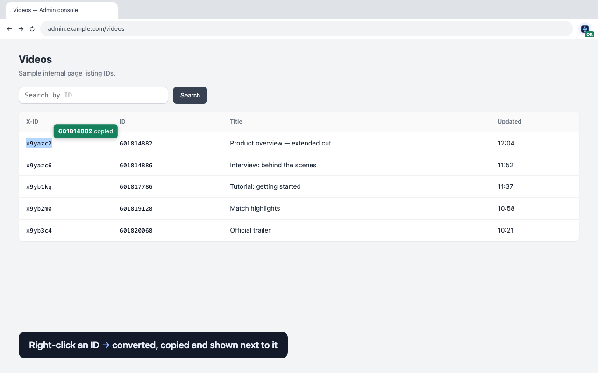
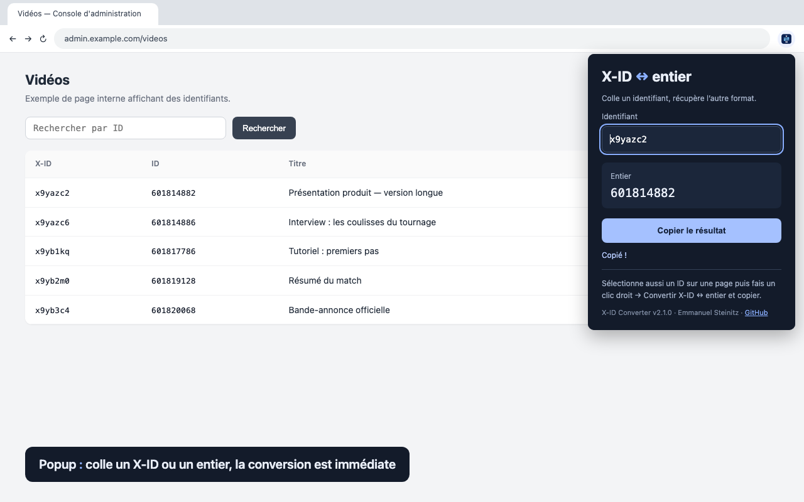
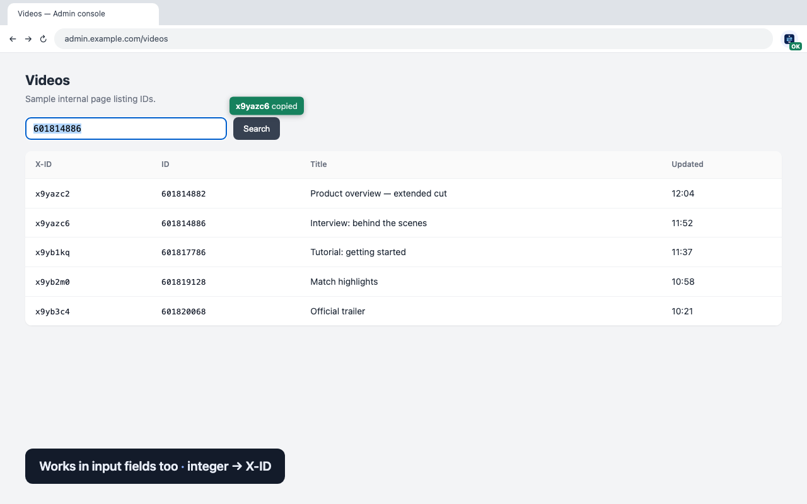

# X-ID Converter

[](https://github.com/caketuzz/xid-converter/actions/workflows/build.yml)
[](https://developer.chrome.com/docs/extensions/develop/migrate/what-is-mv3)
[](manifest.json)
[](LICENSE)

Lightweight Chrome extension that converts between a decimal integer ID and its X-ID form: `x` followed by the base-36 representation (`601814882` ↔ `x9yazc2`). Works from the toolbar popup or with a right-click on any selected ID. No build step, no dependency, BigInt arithmetic, so large IDs never lose precision.

🇫🇷 [Version française plus bas](#version-française)



| Popup | In input fields |
| --- | --- |
|  |  |

## Features

- **Popup**: paste an integer or an X-ID, the conversion is instant. Click **Copy result** or press Enter.
- **Right-click**: select just the ID on a page, then **Convert X-ID ↔ integer and copy**. The result is copied to the clipboard and shown in a tooltip at the top-right of the selection (click it or scroll to dismiss). The toolbar badge shows **OK**, or **!** on error, with details in the popup. The last right-click conversion stays visible in the popup for the current Chrome session.
- Surrounding whitespace and uppercase letters are accepted. URLs, JSON prefixes, signs and multi-ID selections are rejected.

Examples: `x9yazc2` ↔ `601814882`; `x9yazc6` ↔ `601814886`.

## Installation

### From a release ZIP (developer mode)

1. Download `xid-converter-<version>.zip` from the [Releases](https://github.com/caketuzz/xid-converter/releases), or build it (see [Packaging](#packaging)), and unzip it into a folder you keep.
2. Open `chrome://extensions` (Chrome 116 or later) and enable **Developer mode** (top right).
3. Click **Load unpacked** and select the unzipped folder.
4. Pin the extension from Chrome's Extensions button.

There are no automatic updates in this mode: replace the folder with a newer release, then click ↻ in `chrome://extensions`.

### From source

1. Run `npm run build`: this creates `dist/xid-converter/`, which contains only the extension files (no keys, tests or extra sources).
2. In `chrome://extensions`, enable **Developer mode**, click **Load unpacked** and select `dist/xid-converter`.
3. After a change, run `npm run build` again and click ↻ in `chrome://extensions`.

### Without developer mode

Outside developer mode, Chrome only installs extensions from the Chrome Web Store, or through enterprise policy on managed devices. A `.crx` dragged into `chrome://extensions` is rejected. See [Packaging](#packaging).

## Permissions and privacy

Everything runs locally: no server, no network request, no telemetry, no broad page access. The extension never reads the clipboard. See the [privacy policy](PRIVACY.md).

- `activeTab` + `scripting`: show the tooltip in the tab where the menu was just used, only at that moment (no persistent page access, no install warning).
- `contextMenus`: menu entry on selected text.
- `clipboardWrite`: write the result to the clipboard.
- `offscreen`: hidden document required to copy from the service worker.
- `storage`: last conversion and possible error, in session memory only.

Chrome does not always show extension menus on some internal surfaces, such as DevTools; use the popup there. The tooltip cannot be injected on `chrome://` pages, the Web Store or cross-origin iframes; copy and badge still work. The service worker copies through the offscreen document with `execCommand('copy')`, following Chrome's offscreen-clipboard sample.

## Project structure

```
manifest.json
LICENSE, NOTICE                  Apache 2.0 license and copyright (shipped with the extension)
PRIVACY.md, CHANGELOG.md
icons/                           icon-16/32/48/128.png, icon-source.png (original to resize)
src/
  background/service-worker.js   context menu, badge, copy orchestration
  popup/                         popup.html, popup.js, popup.css
  content/tooltip.js             tooltip injected into the page after a right-click
  offscreen/                     offscreen document used to copy (offscreen.html, offscreen.js)
  lib/converter.js               X-ID ↔ integer conversion (shared, tested)
store/                           Chrome Web Store listing texts and images
scripts/                         packaging, version sync and store-image generation
.github/workflows/build.yml      CI: test, ZIP artifact, GitHub Release on v* tags
tests/                           Node tests (node --test)
```

## Packaging

```
npm run build                                      # dist/xid-converter/ (developer mode)
npm run package                                    # + dist/xid-converter-<version>.zip
npm run package:crx -- --base-url=https://host/xid # + signed .crx and update.xml
```

All three commands run the tests first. The package is built from an allowlist (`manifest.json`, `LICENSE`, `NOTICE`, `src/`, `icons/icon-{16,32,48,128}.png`), and hidden files (`.DS_Store`…) are dropped. The script checks that every file referenced by the manifest is included, and that `package.json` and `manifest.json` versions match. Excluded: `tests/`, `scripts/`, `store/`, `README.md`, `PRIVACY.md`, `CHANGELOG.md`, `package.json`, `icons/icon-source.png`, `keys/`, `dist/`.

GitHub Actions ([build.yml](.github/workflows/build.yml)) runs the tests and builds the ZIP on every push to `main` and every pull request (downloadable as a run artifact), and attaches it to a [GitHub Release](https://github.com/caketuzz/xid-converter/releases) for each `v*` tag.

**Self-hosted, through policy**: host `dist/*.crx` and `dist/update.xml` at the URL given as `--base-url`, then deploy the `ExtensionInstallForcelist` (or `ExtensionSettings`) policy with the value `<ID>;<base-url>/update.xml` printed by the script. Chrome only applies these policies to off-store extensions on managed devices (MDM on macOS, domain/Intune on Windows, or Chrome Browser Cloud Management).

The signing key `keys/xid-converter.pem` is created on the first `package:crx` (path configurable with `CRX_KEY`). It determines the extension ID: back it up outside the repository (it is git-ignored). Losing it means redeploying under a new ID.

## Development

`npm test` (Node.js 18+) runs the conversion tests, with nothing to install.

Manual check after installing: select `x9yazc2` on a web page, use the menu, then paste into a field: expected `601814882`, with a green tooltip next to the selection. Repeat with `601814886`: expected `x9yazc6`. Select `bonjour!`: expected `!` badge, red tooltip and message in the popup. Also check conversion and copy in the popup.

Automated tests cover the conversion only. Copy, menu and tooltip must be checked in Chrome with the extension loaded.

References:
- https://developer.chrome.com/docs/extensions/reference/api/contextMenus
- https://developer.chrome.com/docs/extensions/reference/api/offscreen
- https://developer.chrome.com/docs/extensions/reference/api/scripting
- https://github.com/GoogleChrome/chrome-extensions-samples/tree/main/functional-samples/cookbook.offscreen-clipboard

## License and author

© 2026 Emmanuel Steinitz ([@caketuzz](https://github.com/caketuzz)) — released under the [Apache License 2.0](LICENSE). Bugs and suggestions: [issues](https://github.com/caketuzz/xid-converter/issues).

---

## Version française

L'interface de l'extension est en anglais.

Extension Chrome légère de conversion entre un identifiant entier décimal et sa forme X-ID : `x` suivi de la représentation base 36 (`601814882` ↔ `x9yazc2`). Fonctionne depuis la popup ou par clic droit sur un identifiant sélectionné. Sans build ni dépendance, calculs en BigInt pour conserver la précision des grands identifiants.

### Utilisation

- **Popup** : coller un entier ou un X-ID. La conversion est immédiate. Cliquer **Copy result**, ou appuyer sur Entrée dans le champ.
- **Clic droit** : sélectionner uniquement l'identifiant sur une page, puis **Convert X-ID ↔ integer and copy**. Le résultat est copié automatiquement et une info-bulle l'affiche en haut à droite de la sélection (clic dessus ou défilement pour la fermer). Un badge **OK** apparaît sur l'extension ; **!** signale une erreur, détaillée dans la popup. La dernière conversion par clic droit reste visible dans la popup pour la session Chrome courante.
- Les espaces autour de l'identifiant et les lettres majuscules sont acceptés. Les URL, préfixes JSON, signes et sélections de plusieurs identifiants sont rejetés.

Exemples : `x9yazc2` ↔ `601814882` ; `x9yazc6` ↔ `601814886`.

### Installation

**Depuis un ZIP (mode développeur)** : télécharger `xid-converter-<version>.zip` depuis les [Releases](https://github.com/caketuzz/xid-converter/releases), ou le construire avec `npm run package`, puis le décompresser dans un dossier à conserver. Ouvrir `chrome://extensions` (Chrome 116 minimum), activer **Mode développeur**, cliquer **Charger l'extension non empaquetée** et choisir ce dossier. Pas de mise à jour automatique : remplacer le dossier par une nouvelle version, puis cliquer sur ↻.

**Depuis les sources** : `npm run build` crée `dist/xid-converter/` (uniquement les fichiers de l'extension : ni clés, ni tests, ni sources annexes), à charger de la même façon. Après une modification, relancer `npm run build` puis cliquer sur ↻.

**Sans mode développeur** : Chrome n'installe une extension que depuis le Chrome Web Store, ou par politique d'entreprise sur des postes gérés. Un `.crx` glissé dans `chrome://extensions` est refusé.

### Permissions et confidentialité

Tout fonctionne localement, sans serveur, requête réseau, télémétrie ni accès général aux pages. L'extension ne lit pas le presse-papiers. Voir la [politique de confidentialité](PRIVACY.md).

- `activeTab` + `scripting` : affichage de l'info-bulle dans l'onglet où le menu vient d'être utilisé, uniquement à ce moment-là (aucun accès permanent aux pages, aucun avertissement à l'installation).
- `contextMenus` : menu sur le texte sélectionné.
- `clipboardWrite` : écriture du résultat dans le presse-papiers.
- `offscreen` : document masqué nécessaire à la copie depuis le service worker.
- `storage` : dernière conversion et éventuelle erreur, en mémoire de session uniquement.

Chrome n'affiche pas nécessairement le menu d'une extension dans certaines surfaces internes, notamment les DevTools : utiliser la popup. L'info-bulle ne peut pas s'afficher sur les pages `chrome://`, le Web Store ou les iframes d'une autre origine ; la copie et le badge fonctionnent quand même.

### Packaging

```
npm run build                                      # dist/xid-converter/ (mode développeur)
npm run package                                    # + dist/xid-converter-<version>.zip
npm run package:crx -- --base-url=https://hôte/xid # + .crx signé et update.xml
```

Les commandes de packaging lancent les tests d'abord, et le paquet est construit à partir d'une liste blanche (voir [Packaging](#packaging) pour le détail des fichiers inclus et exclus).

- **GitHub Actions** ([build.yml](.github/workflows/build.yml)) : tests et ZIP à chaque push sur `main` et chaque pull request (artifact du run), et ZIP attaché à une [GitHub Release](https://github.com/caketuzz/xid-converter/releases) pour chaque tag `v*`.
- **Auto-hébergé, par politique** : héberger `dist/*.crx` et `dist/update.xml` à l'URL passée en `--base-url`, puis déployer la politique `ExtensionInstallForcelist` avec la valeur `<ID>;<base-url>/update.xml` affichée par le script. Uniquement sur des postes gérés (MDM sur macOS, domaine/Intune sur Windows, Chrome Browser Cloud Management).
- La clé de signature `keys/xid-converter.pem` est créée au premier `package:crx` (chemin modifiable via `CRX_KEY`). Elle détermine l'ID de l'extension : la sauvegarder hors du dépôt (elle est ignorée par git).

### Développement et vérification

`npm test` (Node.js 18+) lance les tests de conversion, sans installation préalable.

Vérification manuelle après installation : sélectionner `x9yazc2` dans une page web, déclencher le menu puis coller dans un champ : attendu `601814882`, avec une info-bulle verte à côté de la sélection. Refaire avec `601814886` : attendu `x9yazc6`. Sélectionner `bonjour!` : attendu badge `!`, info-bulle rouge et message dans la popup. Vérifier aussi la conversion et la copie dans la popup.

### Licence et auteur

© 2026 Emmanuel Steinitz ([@caketuzz](https://github.com/caketuzz)) — distribué sous [licence Apache 2.0](LICENSE). Bugs et suggestions : [issues](https://github.com/caketuzz/xid-converter/issues).
